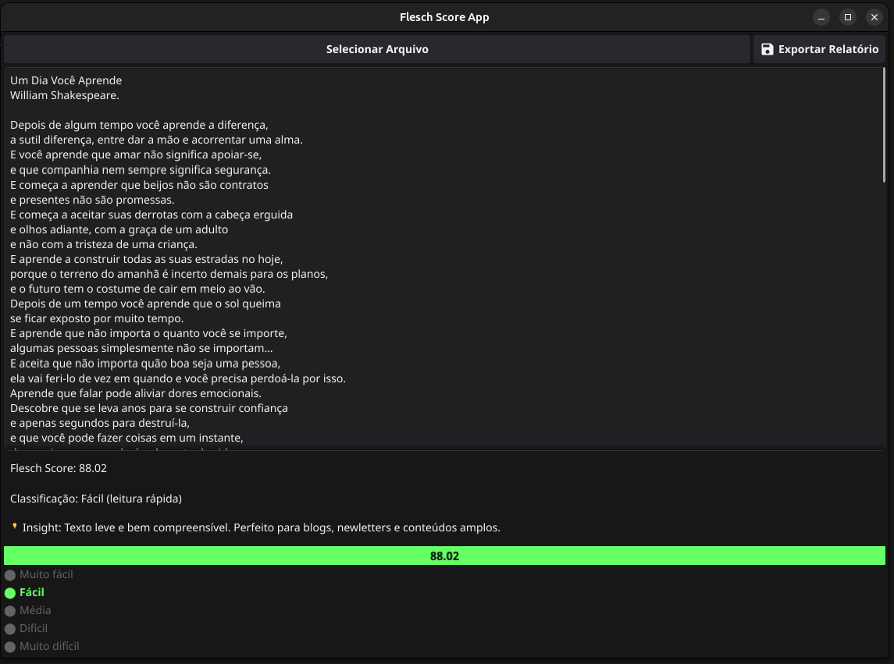

# Readability Analyzer App

Este projeto é um sistema híbrido de análise de legibilidade textual com capacidade de geração de insights com base no nível de dificuldade da leitura. Ele combina múltiplas linguagens (Go, Rust e C++) em um pipeline interoperável de alta performance, ideal para sistemas embarcados, interfaces gráficas, CLI e WebAssembly.

## Principais Funcionalidades

- **Cálculo do Flesch Reading Ease Score** via biblioteca escrita em Rust.
- **Classificação de legibilidade** com base em faixas: `muito_fácil`, `fácil`, `média`, `difícil`, `muito_difícil`.
- **Geração de insights automatizados** via similaridade textual com um corpus de exemplos.
- **Interoperabilidade**: integração Rust → C → Go para máxima performance e flexibilidade.
- **UI simples e eficaz** escrita em Go, com capacidade de carregar arquivos e processar texto em tempo real.

## Como Funciona

O sistema possui três módulos principais:

1. **Flesch Score Engine (`readability` - Rust)**:
   - Expõe uma função C ABI (`get_text_stats`) para consumo externo.
   - Calcula: número de palavras, sentenças, sílabas e score.

2. **Text Embedder (`text_embedder` - C++)**:
   - Recebe um texto de entrada e o compara com um `corpus/insight_corpus.json` via TF-IDF + similaridade de cosseno.
   - Retorna uma `label` que representa a dificuldade estimada do texto.
3. **UI (`User Interface` - Golang)**:
   - Carrega arquivo de texto e processa em tempo real.
   - Retorna o calculo de legibilidade do texto com insight com base na métrica obtida.

## Estrutura do Projeto

```
flesch_score/
├── app/                  # UI em golang
├── cli/                  # CLI em C
├── readability/          # Enginedo calculo de flesch score em Rust
├── text_embedder/        # Modelo Treinado para classificar o texto em C++
├── corpus/               # Corpus de exemplos para geração de insights
│   └── insight_corpus.json # Exemplo de corpus
├── assets/               # Imagens e outros recursos
├── README.md             # Este documento
```

## Como Rodar

### Requisitos

- Go >= 1.21
- Rust (com cargo) >= 1.70
- C++ compiler (g++ recomendado)
- g++ (para compilar o embedder C++)
- Linux (preferencialmente)

### Compilação

1. Compile a biblioteca Rust:

```bash
cd flesch_score/readability
cargo build --release
```

2. Compile o embedder:

```bash
cd flesch_score/text_embedder
make main  # ou g++ -O2 -fPIC -shared -o libtext_embedder.so text_embedder.cpp
```

3. Execute o app Go com as bibliotecas:

```bash
cd flesch_score/app
make run
```

> O script `make run` cuida de definir o `LD_LIBRARY_PATH` corretamente.

## Exemplo de Saída




## Interoperabilidade entre Linguagens

### Por que usar mais de uma linguagens?

-   **Rust** → Segurança e precisão matemática para cálculo do Flesch Score;
-   **C++** → Alta performance para processamento textual semântico com vetores TF-IDF;
-   **Go** → Agilidade no desenvolvimento da interface + integração de bibliotecas externas.
    
### Comunicação entre elas:

-   Go chama o `.so` de Rust e C++ via `cgo`;
-   O Rust e C++ exporta funções com `extern "C"` para compatibilidade; 
-   Dados são passados como `*char` e manipulados como `C.CString`, `C.GoString`, etc.

## Vantagens

- **Alta performance** com Rust para cálculo matemático intensivo.
- **Modularidade**: cada linguagem cumpre uma função específica.
- **Cross-platform-ready**: pode ser usado em sistemas desktop, CLI ou frontend (via WASM).
- **insights automatizados**: ajuda o usuário a entender a legibilidade do texto.
- **Fácil de estender**: novos módulos podem ser adicionados com outras linguagens se necessário.

## Possibilidades Futuras
-   Substituição do TF-IDF por embeddings neurais (e.g. FastText, TinyBERT)
-   Interface web ou API RESTful

## Licença

[Portifolio - Junior Paula](https://juniorpaula.com.br)

MIT © 2025 - Junior Paula